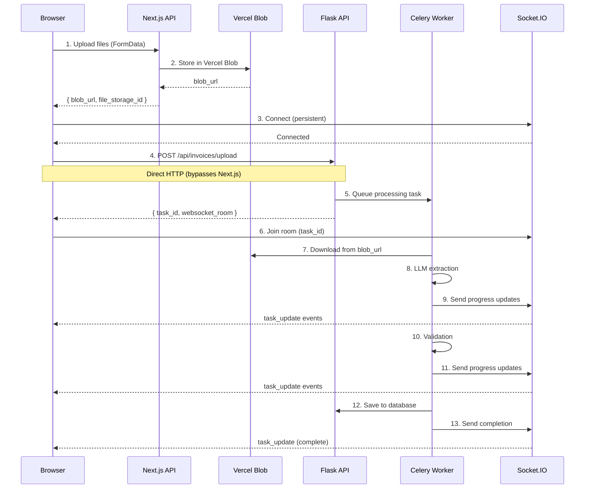

# WebSocket Integration Architecture

## Overview

The frontend uses **direct WebSocket connections to the Flask API** for real-time updates during long-running invoice processing tasks. This architecture bypasses Next.js entirely for async operations, enabling real-time progress tracking with minimal latency.

## Architecture Diagram



---

## Component Architecture

### 1. Direct Flask Client (`/lib/flask-client.ts`)

**Purpose**: Enable direct browser → Flask API communication for long-running operations.

**Key Features**:
- Bypasses Next.js for async operations
- Handles authentication via Bearer tokens
- Supports JSON payloads
- Configurable timeouts

**API Methods**:

```typescript
class DirectFlaskClient {
  // Trigger invoice processing with blob URL
  async triggerInvoiceProcessing(
    blobUrl: string,
    filename: string,
    options?: {
      auto_save?: boolean;
      confidence_threshold?: number;
      model_provider?: "openai" | "anthropic";
      human_in_loop?: boolean;
    }
  ): Promise<ProcessingResponse>

  // Get processing status
  async getProcessingStatus(taskId: string): Promise<any>

  // Analyze document
  async analyzeDocument(documentId: string, options?): Promise<any>
}
```

**Usage**:
```typescript
import { flaskClient } from "@/lib/flask-client";

const response = await flaskClient.triggerInvoiceProcessing(
  "https://blob.vercel-storage.com/...",
  "invoice-001.pdf",
  { auto_save: true, confidence_threshold: 0.8 }
);

// Returns:
// {
//   task_id: "task_abc123",
//   websocket: { room: "task_abc123", events: ["task_update"] }
// }
```

---

### 2. Processing API (`/lib/api/processing.ts`)

**Purpose**: Orchestrate the complete upload and processing flow.

**Flow Architecture**:

```typescript
// Single file processing
async uploadAndProcess(file: File, options?) {
  // Step 1: Upload to Vercel Blob via Next.js
  const { blob_url } = await uploadFileToBlob(file);

  // Step 2: Trigger Flask processing directly
  const { task_id, websocket_room } = await flaskClient.triggerInvoiceProcessing(
    blob_url,
    file.name,
    options
  );

  return { task_id, websocket_room, blob_url };
}

// Batch processing (parallel)
async uploadAndProcessBatch(files: File[], options?) {
  // Upload all files to blob in parallel
  const blobs = await Promise.all(
    files.map(file => uploadFileToBlob(file))
  );

  // Trigger Flask processing for all blobs in parallel
  const tasks = await Promise.all(
    blobs.map((blob, i) =>
      flaskClient.triggerInvoiceProcessing(blob.blob_url, files[i].name, options)
    )
  );

  return tasks; // Array of { task_id, websocket_room }
}
```

**Design Decision**: Parallel uploads and parallel Flask triggers maximize throughput for batch operations.

---

### 3. WebSocket Hook (`/hooks/useAsyncProcessing.ts`)

**Purpose**: Manage WebSocket connection and track multiple file processing states.

**State Management**:

```typescript
interface FileProcessingState {
  task_id: string;
  filename: string;
  status: "pending" | "processing" | "completed" | "error";
  progress: number;      // 0-100
  stage: string;         // "fetch" | "llm_extraction" | "validation" | "save"
  updates: ProcessingUpdate[];
  result: any;
  error: string | null;
}

interface ProcessingState {
  isConnected: boolean;
  files: Map<string, FileProcessingState>;  // Key: task_id
}
```

**WebSocket Event Handlers**:

```typescript
// Connect to Flask on mount (persistent connection)
useEffect(() => {
  const socket = io(process.env.NEXT_PUBLIC_FLASK_API_URL, {
    cors: { origin: window.location.origin, credentials: true }
  });

  socket.on("connect", () => {
    console.log("Connected to Flask WebSocket");
    setState(prev => ({ ...prev, isConnected: true }));
  });

  // Listen for task updates
  socket.on("task_update", (data: ProcessingUpdate) => {
    const { task_id, progress, stage, message, type } = data;

    // Update file state
    setState(prev => {
      const files = new Map(prev.files);
      const file = files.get(task_id);

      if (file) {
        file.progress = progress || file.progress;
        file.stage = stage || file.stage;
        file.updates.push(data);

        if (type === "complete") {
          file.status = "completed";
          file.result = data.result;
        } else if (type === "error") {
          file.status = "error";
          file.error = message;
        }

        files.set(task_id, file);
      }

      return { ...prev, files };
    });
  });

  return () => socket.close();
}, []);
```

**API Methods**:

```typescript
const hook = useAsyncProcessing();

// Start batch processing
const taskIds = await hook.startBatchProcessing(files, {
  auto_save: true,
  confidence_threshold: 0.8,
  model_provider: "openai"
});

// Access state
hook.isConnected;     // WebSocket connection status
hook.files[];         // Array of FileProcessingState
hook.resetProcessing(); // Clear all state
```

---

### 4. Document Upload Component (`/components/DocumentUpload.tsx`)

**Purpose**: User interface for batch invoice upload with real-time progress tracking.

**Features**:
- Multi-file selection (up to 10 files)
- Real-time progress bars per file
- WebSocket connection status indicator
- Individual file status tracking
- Error handling per file

**Component Flow**:

```typescript
export function DocumentUpload({ maxFiles = 10 }) {
  const [selectedFiles, setSelectedFiles] = useState<File[]>([]);
  const { isConnected, files, startBatchProcessing } = useAsyncProcessing();

  const handleUpload = async () => {
    // Validate
    if (!isConnected) {
      setError("WebSocket not connected");
      return;
    }

    // Start batch processing
    await startBatchProcessing(selectedFiles, {
      auto_save: true,
      confidence_threshold: 0.8
    });

    // Clear selection
    setSelectedFiles([]);
  };

  return (
    <div>
      {/* Connection Status */}
      <div className="flex items-center">
        <div className={`w-2 h-2 rounded-full ${
          isConnected ? "bg-green-500" : "bg-red-500"
        }`} />
        <span>{isConnected ? "Connected" : "Disconnected"}</span>
      </div>

      {/* File Selection */}
      <input type="file" multiple onChange={handleFileSelect} />

      {/* Selected Files */}
      {selectedFiles.map((file, i) => (
        <div key={i}>{file.name}</div>
      ))}

      {/* Upload Button */}
      <button onClick={handleUpload} disabled={!isConnected}>
        Upload & Process All
      </button>

      {/* Processing Files (Real-time Updates) */}
      {files.map((file) => (
        <div key={file.task_id}>
          <span>{file.filename}</span>
          <span>{file.status}</span>
          <span>{file.stage}</span>

          {/* Progress Bar */}
          <div className="progress-bar">
            <div style={{ width: `${file.progress}%` }} />
          </div>

          {file.error && <span className="error">{file.error}</span>}
        </div>
      ))}
    </div>
  );
}
```

---

## Flask Backend Integration

### Flask API Endpoint (`/api/invoices/upload`)

**Expected Request**:
```json
{
  "blob_url": "https://vercel-blob.com/abc123.png",
  "filename": "invoice-001.png",
  "auto_save": true,
  "confidence_threshold": 0.8,
  "model_provider": "openai"
}
```

**Response**:
```json
{
  "success": true,
  "task_id": "task_xyz789",
  "celery_task_id": "celery_abc",
  "filename": "invoice-001.png",
  "status": "queued",
  "message": "Invoice processing started. Connect to WebSocket for real-time updates.",
  "websocket": {
    "room": "task_xyz789",
    "events": ["task_update"]
  },
  "processing": {
    "auto_save": true,
    "confidence_threshold": 0.8,
    "user_id": "user_123",
    "user_email": "user@example.com"
  }
}
```

### Celery Task Processing Stages

The backend sends WebSocket updates through these stages:

**1. Fetch Stage**
```json
{
  "type": "stage_start",
  "task_id": "task_xyz789",
  "stage": "fetch",
  "message": "Preparing image for processing...",
  "progress": 5,
  "timestamp": 1234567890
}
```

**2. LLM Extraction Stage**
```json
{
  "type": "progress",
  "task_id": "task_xyz789",
  "stage": "llm_extraction",
  "message": "Analyzing invoice with AI...",
  "progress": 50,
  "timestamp": 1234567891
}
```

**3. Validation Stage**
```json
{
  "type": "stage_start",
  "task_id": "task_xyz789",
  "stage": "validation",
  "message": "Validating extracted data...",
  "progress": 85,
  "timestamp": 1234567892
}
```

**4. Save Stage** (if auto_save enabled)
```json
{
  "type": "stage_start",
  "task_id": "task_xyz789",
  "stage": "save",
  "message": "Saving invoice to database...",
  "progress": 95,
  "timestamp": 1234567893
}
```

**5. Completion**
```json
{
  "type": "complete",
  "task_id": "task_xyz789",
  "progress": 100,
  "message": "Processing complete!",
  "result": {
    "invoice_id": "inv_123",
    "confidence_score": 0.92,
    "requires_review": false,
    "extracted_data": { /* ... */ }
  },
  "timestamp": 1234567894
}
```

### Error Handling

**Error Event**:
```json
{
  "type": "error",
  "task_id": "task_xyz789",
  "stage": "llm_extraction",
  "message": "LLM extraction failed: Rate limit exceeded",
  "error": "Rate limit exceeded",
  "timestamp": 1234567895
}
```

---

## Architecture Decision Records (ADRs)

### ADR-001: Direct Flask Communication for Long-Running Tasks

**Context**: Invoice processing involves long-running LLM operations (10-30 seconds per invoice). Next.js API routes have serverless function timeout limits.

**Decision**: Use **direct browser → Flask API communication** for triggering processing tasks, bypassing Next.js entirely.

**Rationale**:
- ✅ No serverless timeout limits
- ✅ Real-time WebSocket updates without Next.js proxy overhead
- ✅ Flask handles auth validation via Bearer tokens
- ✅ Celery workers can process in parallel

**Consequences**:
- Next.js is only used for: Authentication, blob upload, database CRUD
- Flask handles: LLM processing, Celery jobs, WebSocket updates
- CORS must be configured on Flask API

**Alternatives Considered**:
- ❌ Next.js API proxy → Flask: Adds latency, complexity
- ❌ Server-Sent Events: One-way only, no bidirectional communication
- ❌ Polling: High latency, inefficient

---

### ADR-002: Individual Celery Tasks per Image

**Context**: Users can upload 1-10 invoices simultaneously.

**Decision**: Create **one Celery task per image** rather than one batch task.

**Rationale**:
- ✅ **Parallel processing**: Multiple Celery workers can process images simultaneously
- ✅ **Failure isolation**: One failed image doesn't block others
- ✅ **Independent progress tracking**: Each file has its own WebSocket room
- ✅ **Retry granularity**: Can retry individual failed images
- ✅ **Already implemented**: Flask backend is designed for single-image tasks

**Consequences**:
- 10 images = 10 POST requests to Flask
- 10 WebSocket rooms to join
- Frontend must track multiple task_ids

**Performance**:
- With 4 Celery workers: 10 images process in ~3 rounds (4+4+2)
- Total time: ~3x single image processing time
- Much faster than sequential processing (10x single image time)

**Alternatives Considered**:
- ❌ Single batch task: Sequential processing, all-or-nothing failure
- ❌ Threading in single task: Complex error handling, limited parallelism

---

### ADR-003: Persistent WebSocket Connection

**Context**: Users may upload multiple batches during a session.

**Decision**: Connect to Flask WebSocket **once on component mount**, maintain persistent connection.

**Rationale**:
- ✅ **Lower latency**: No connection overhead per upload
- ✅ **Better UX**: Connection status visible to user
- ✅ **Resource efficient**: Single connection for entire session
- ✅ **Socket.IO auto-reconnect**: Handles network interruptions

**Consequences**:
- WebSocket connects on page load
- Must handle reconnection scenarios
- Connection status shown in UI

**Alternatives Considered**:
- ❌ Connect per upload: Higher latency, connection overhead
- ❌ Polling: High latency, inefficient

---

## Data Flow

### Complete Upload and Processing Flow

```
┌─────────────────────────────────────────────────────────────────┐
│ PHASE 1: File Upload to Blob Storage (via Next.js)              │
└─────────────────────────────────────────────────────────────────┘

Browser                    Next.js API              Vercel Blob
  │                            │                         │
  │──── POST /api/upload ─────▶│                         │
  │    (FormData)              │                         │
  │                            │──── Upload file ───────▶│
  │                            │                         │
  │                            │◀─── blob_url ───────────│
  │                            │                         │
  │                            │ [Create file_storage    │
  │                            │  record in Postgres]    │
  │                            │                         │
  │◀─── { blob_url } ──────────│                         │
  │                            │                         │

┌─────────────────────────────────────────────────────────────────┐
│ PHASE 2: WebSocket Connection (persistent)                      │
└─────────────────────────────────────────────────────────────────┘

Browser                    Flask Socket.IO
  │                            │
  │──── Connect ──────────────▶│
  │                            │
  │◀─── Connected ─────────────│
  │                            │

┌─────────────────────────────────────────────────────────────────┐
│ PHASE 3: Trigger Processing (direct to Flask)                   │
└─────────────────────────────────────────────────────────────────┘

Browser                    Flask API              Celery/Redis
  │                            │                         │
  │─ POST /api/invoices/upload │                         │
  │  (JSON: blob_url)          │                         │
  │                            │                         │
  │                            │─── Queue task ─────────▶│
  │                            │    .delay()             │
  │                            │                         │
  │◀─ { task_id, room } ───────│                         │
  │                            │                         │
  │─ socket.emit('join_task')─▶│                         │
  │  { task_id }               │                         │
  │                            │                         │

┌─────────────────────────────────────────────────────────────────┐
│ PHASE 4: Celery Processing + WebSocket Updates                  │
└─────────────────────────────────────────────────────────────────┘

Browser       Flask WebSocket    Celery Worker      Vercel Blob
  │                 │                  │                  │
  │                 │                  │─ Download ──────▶│
  │                 │◀─ Progress (10%) ┤                  │
  │◀─ task_update ──│                  │                  │
  │  (fetch)        │                  │                  │
  │                 │                  │                  │
  │                 │                  │─ LLM Extract     │
  │                 │◀─ Progress (50%) ┤  (OpenAI/Claude) │
  │◀─ task_update ──│                  │                  │
  │  (llm_extract)  │                  │                  │
  │                 │                  │                  │
  │                 │                  │─ Validate        │
  │                 │◀─ Progress (85%) ┤                  │
  │◀─ task_update ──│                  │                  │
  │  (validation)   │                  │                  │
  │                 │                  │                  │
  │                 │                  │─ Save to DB      │
  │                 │◀─ Progress (95%) ┤                  │
  │◀─ task_update ──│                  │                  │
  │  (save)         │                  │                  │
  │                 │                  │                  │
  │                 │◀─ Complete ──────┤                  │
  │◀─ task_update ──│                  │                  │
  │  (complete)     │                  │                  │
  │                 │                  │                  │
```

---

## Configuration

### Environment Variables

**Frontend** (`.env`):
```bash
# Flask API URL (for direct browser → Flask communication)
NEXT_PUBLIC_FLASK_API_URL=http://localhost:5000

# Next.js API URL (for blob upload)
NEXT_PUBLIC_API_URL=http://localhost:3000

# Vercel Blob Storage
BLOB_READ_WRITE_TOKEN=vercel_blob_...
```

**Backend** (`backend/.env`):
```bash
# Celery
CELERY_BROKER_URL=redis://localhost:6379/0
CELERY_RESULT_BACKEND=redis://localhost:6379/1

# CORS (allow Next.js origin)
FRONTEND_URL=http://localhost:3000

# LLM APIs
OPENAI_API_KEY=sk-...
ANTHROPIC_API_KEY=sk-ant-...
```

---

## Monitoring and Debugging

### Browser Console Logs

**WebSocket Connection**:
```javascript
console.log("Connected to Flask WebSocket server");
console.log("Task update received:", data);
console.log("Joined task room:", { task_id });
```

**Processing Stages**:
```javascript
console.log("API Request: POST /api/invoices/upload");
console.log("Starting batch processing:", files.length, "files");
console.log("Task IDs:", taskIds);
```

### Flask Logs

**Processing Start**:
```python
app.logger.info(f"Started invoice processing: task_id={task_id}")
```

**WebSocket Updates**:
```python
app.logger.info(f"Sending progress: task={task_id}, progress={progress}, stage={stage}")
```

**Errors**:
```python
app.logger.error(f"Invoice upload failed: {str(e)}")
```

### Metrics to Track

1. **WebSocket Connection Rate**: Connections per minute
2. **Task Queue Length**: Celery pending tasks
3. **Processing Time**: Average time per invoice
4. **Error Rate**: Failed tasks / total tasks
5. **Concurrent Tasks**: Active Celery workers

---

## Security Considerations

### Authentication Flow

1. **User logs in** → Better Auth creates session
2. **Session token** stored in browser
3. **Flask requests** include `Authorization: Bearer {token}`
4. **Flask validates token** against Better Auth

### CORS Configuration

Flask must allow requests from Next.js origin:

```python
CORS(app, origins=[app.config['FRONTEND_URL']], supports_credentials=True)
```

### WebSocket Security

Socket.IO connection includes credentials:
```typescript
const socket = io(flaskUrl, {
  cors: { origin: window.location.origin, credentials: true }
});
```

---

## Performance Optimization

### Parallel Processing

**With 4 Celery Workers**:
- 10 images = 3 processing rounds (4 + 4 + 2)
- Total time ≈ 3× single image time
- vs. Sequential: 10× single image time

**Scaling**:
- Add more Celery workers for higher throughput
- Redis handles task queue
- Each worker processes independently

### WebSocket Efficiency

- **Single persistent connection** per user session
- **Multiplexed rooms** (one per task_id)
- **Binary protocol** for lower overhead
- **Auto-reconnect** on network interruption

---

## Testing

### Unit Tests

```typescript
// Test Flask client
describe("DirectFlaskClient", () => {
  it("should trigger invoice processing", async () => {
    const response = await flaskClient.triggerInvoiceProcessing(
      "https://blob.com/test.pdf",
      "test.pdf"
    );
    expect(response.task_id).toBeDefined();
    expect(response.websocket.room).toMatch(/^task_/);
  });
});

// Test WebSocket hook
describe("useAsyncProcessing", () => {
  it("should connect to WebSocket on mount", () => {
    const { result } = renderHook(() => useAsyncProcessing());
    expect(result.current.isConnected).toBe(true);
  });
});
```

### Integration Tests

1. **Upload Flow**: File → Blob → Flask → Celery → WebSocket
2. **Batch Processing**: 10 files in parallel
3. **Error Handling**: Network failure, API errors
4. **Reconnection**: WebSocket disconnect/reconnect

### Manual Testing Checklist

- [ ] WebSocket connects on page load
- [ ] Connection status shows "Connected"
- [ ] Single file upload triggers processing
- [ ] Real-time progress updates appear
- [ ] Multiple files process in parallel
- [ ] Error messages display correctly
- [ ] Completed files show results
- [ ] Page refresh maintains connection

---

## Troubleshooting

### Common Issues

**1. WebSocket Not Connected**
- Check Flask API is running: `http://localhost:5000`
- Check CORS configuration in Flask
- Verify `NEXT_PUBLIC_FLASK_API_URL` in `.env`

**2. No Progress Updates**
- Check Celery worker is running
- Check Redis is running
- Verify task_id matches WebSocket room

**3. Upload Fails**
- Check Vercel Blob token is valid
- Check file size < 10MB
- Check file type is allowed

**4. Processing Stalls**
- Check Celery worker logs
- Check LLM API keys are valid
- Check Redis connection

---

## Future Improvements

### Short Term
- [ ] Add retry mechanism for failed tasks
- [ ] Show estimated time remaining
- [ ] Add cancel/pause functionality
- [ ] Persist processing history

### Long Term
- [ ] Implement task prioritization
- [ ] Add batch result export
- [ ] Support drag-and-drop upload
- [ ] Add processing analytics dashboard

---

## References

- [Socket.IO Client Documentation](https://socket.io/docs/v4/client-api/)
- [Celery Documentation](https://docs.celeryproject.org/)
- [Next.js API Routes](https://nextjs.org/docs/api-routes/introduction)
- [Vercel Blob Storage](https://vercel.com/docs/storage/vercel-blob)
- [Better Auth Documentation](https://better-auth.com/docs)